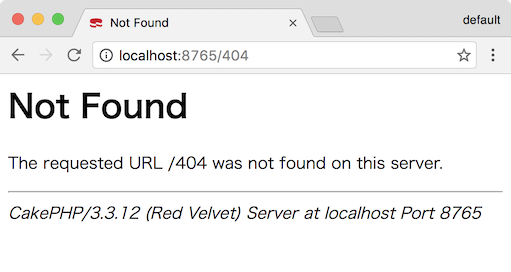
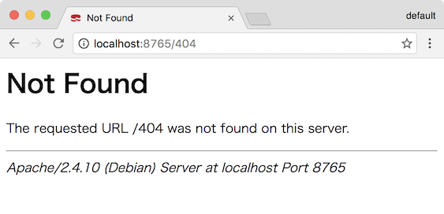
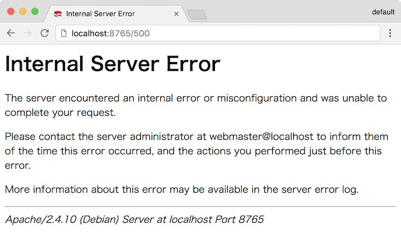

# CakePHP Apache error theme plugin

Make error pages Apache web server style.



## Installation

You can install using [composer](http://getcomposer.org).

```
composer require tenkoma/cakephp-apache-error-theme
```

## Enable Plugin

You can load the plugin using the shell command:

```
bin/cake plugin load CakeApacheErrorTheme
```

Or you can manually add the loading statement in the config/bootstrap.php file of your application:

```php
// config/bootstrap.php
Plugin::load('CakeApacheErrorTheme');
```

## Enable theme

set theme in the `ErrorController::beforeRender()`.

```php
// src/Controller/ErrorController.php
    public function beforeRender(Event $event)
    {
        parent::beforeRender($event);

        $this->viewBuilder()->theme('CakeApacheErrorTheme');
    }
```

and `debug = false` in the `config/app.php`

```php
// config/app.php
    'debug' => false,
```

## Configure

```php
// config/bootstrap.php
Configure::write('CakeApacheErrorTheme', [
    'signature' => 'cake',
    'email' => 'webmaster@example.com',
]);
```

* `signature`
  * `apache` (default)
  * `cake` show CakePHP and version as signature.
* `email` (default=`webmaster@localhost`) E-mail address to be displayed at 5xx error

## Example

### 404 Not Found



### 5xx Internal Error

